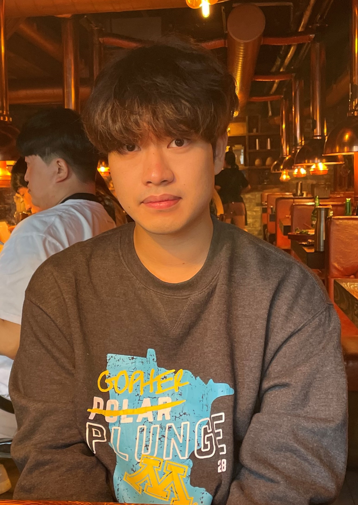

  
   
    깜빡 - We take care of your eye health
   

# Data Collection

 

+ Web Crawling
  + [Google crawling](https://github.com/DatacampusTeam14/blink_project/blob/master/crawling/%EA%B5%AC%EA%B8%80%20%ED%81%AC%EB%A1%A4%EB%A7%81%20(selenium).ipynb)
  + [Naver crawling](https://github.com/DatacampusTeam14/blink_project/blob/master/crawling/%EB%84%A4%EC%9D%B4%EB%B2%84%20%ED%81%AC%EB%A1%A4%EB%A7%81(selenium).ipynb)
  + [Daum crawling](https://github.com/DatacampusTeam14/blink_project/blob/master/crawling/%EB%8B%A4%EC%9D%8C%20%ED%81%AC%EB%A1%A4%EB%A7%81(selenium).ipynb)
  + [Coupang crawling](https://github.com/DatacampusTeam14/blink_project/blob/master/crawling/%EC%BF%A0%ED%8C%A1%20%ED%81%AC%EB%A1%A4%EB%A7%81(selenium).py)
+ [Closed Eye In the wild Dataset](http://parnec.nuaa.edu.cn/_upload/tpl/02/db/731/template731/pages/xtan/ClosedEyeDatabases.html)
+ [Open Image Dataset V6](https://storage.googleapis.com/openimages/web/visualizer/index.html?set=train&type=detection&c=%2Fm%2F0dzct)

 

# Data Preprocessing

+ [LabelImg](https://github.com/heartexlabs/labelImg)

  

+ Data Cleaning

example 1 : low pixel

  

example 2 : wearing sunglasses
  

    
  

 

example 3 : covering eyes
  

    
  

 

# Data Augmentation
+ [Augmentation](https://github.com/DatacampusTeam14/blink_project/tree/master/augmentation)

 

# Model
+ Improve model performance

  

 

# Service Preview
* IntroWindow

* MainWindow

* ResultWindow

 

# Dev Tool

+ LabelImg
+ QTDesigner

 

+ PyCharm
+ VsCode

 

+ Mediapipe
+ Yolo v7

 

# Developer

    <table>
        <tr>
            <td align="center">
                <a href="https://github.com/junhochoi-dev">
                    
                     
                    <b>Choi Jun Ho</b>
                </a>
                 
                <a href="#maintenance-flaxinger" title="Maintenance">🚧</a>
            </td>
            <td align="center">
                <a href="https://github.com/dayun4444">
                    
                     
                    <b>Lee Da Yun</b>
                </a>
                 
                <a href="#maintenance-getCurrentThread" title="Maintenance">🚧</a>
            </td>
            <td align="center">
                <a href="https://github.com/duncan1409">
                    
                     
                    <b>Park Min Hyeong</b>
                </a>
                 
                <a href="#maintenance-getCurrentThread" title="Maintenance">🚧</a>
            </td>
            <td align="center">
                <a href="https://github.com/sms291">
                    
                     
                    <b>Shin Hyo Seop</b>
                </a>
                 
                <a href="#maintenance-getCurrentThread" title="Maintenance">🚧</a>
            </td>
        </tr>
    </table>

 
